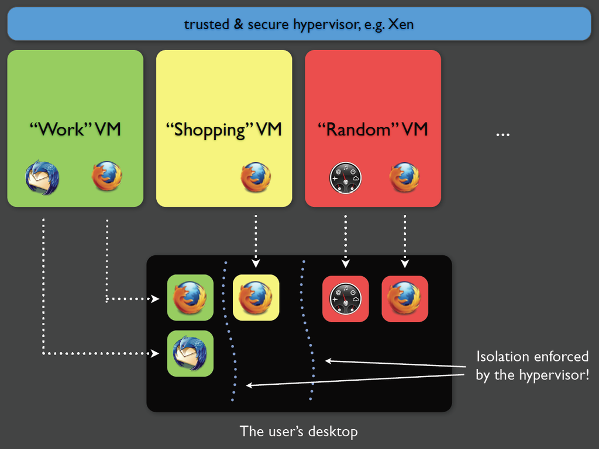
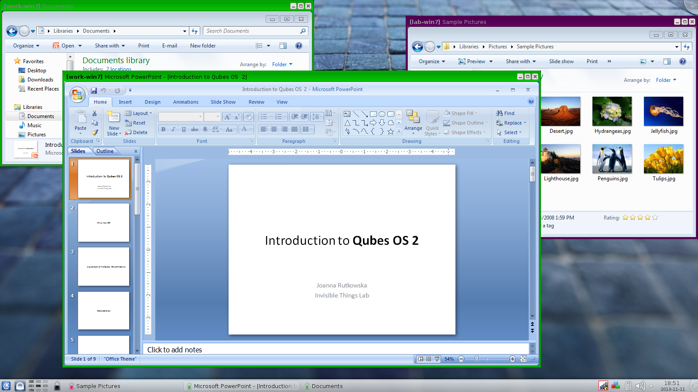
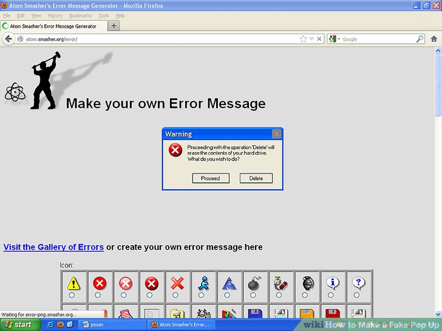
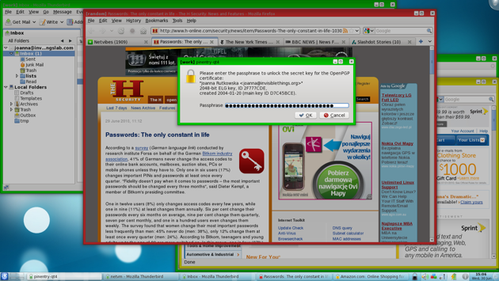
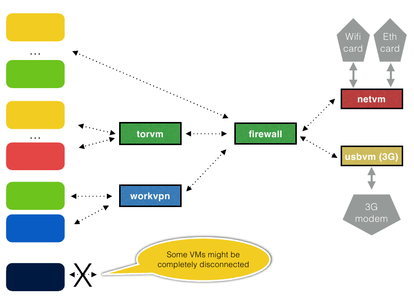

# Segurança?

Formas de contaminação não faltam:

- Navegando sites
- Instalando programas
- Vendo e-mails e anexos
- Abrindo arquivos (docx, pdf etc)
- Acessando pendrives (usb)
- Via rede (wifi, internet)

# Solução!

- Instalar só *software livres* auditados?
- Acessar só sites "confiáveis"?
- Desligar *javascript* do navegador?
- Ver e-mails só como texto?
- Não abrir anexos?
- Usar antivírus?
- Não ter placa wifi?
- Não acessar a internet?

# Abordagem Qubes

**Isolamento + Integração = Compartimentalização!**

- Divisão do computador em domínios (trabalho, pessoal, banco, cofre etc)
- Se um domínio for contaminado, os outros não são afetados

# Qubes

- *Sistema Operacional*
- Concebido por Joanna Rutkowska
	- pesquisadora de segurança polônesa
	- [Invisible Things Lab](https://invisiblethingslab.com)
- Software Livre
- Desenvolvido desde 2010
- Enfoque tanto em segurança como usabilidade
- "Distro *Xen*", e não Linux

# O que traz de novo?

- UNIX já isolava usuários e grupos
- Android isola aplicativos (múltiplas permissões)

Com Qubes isolamento sai do *kernel* e vai para um *hypervisor* (*Xen*)

- Isolamento via *máquinas virtuais*
- Hypervisor usa *microkernel*

# Domínios {.no-title}

[{height=650px}](https://en.wikipedia.org/wiki/Qubes_OS)

# Templates e AppVMs

Sistema de *TemplateVMs* facilita manutenção das máquinas virtuais.

Máquinas virtuais podem rodar múltiplos sistemas operacionais.

- Fedora
- Debian
- Arch Linux
- Ubuntu
- *Whonix*

# Até Windows...

{width=900px}

# Ambiente Gráfico Convencional

- Sistemas operacionais geralmente permitem que qualquer programa capture teclas apertadas, área de transferência, tela etc.
- Não protege contra coisas do tipo...

# Fake! {.no-title}

{height=650px}

# Marcas nas Janelas

{width=900px}

# Janelas isoladas mas integradas

- Uso de bordas coloridas
- Proteção da *área de transferência*
	- Focar janela e ctrl+shift+c/v
- Cada aplicação só acessa janelas, teclado e mouse do seu domínio

# Mapa de Rede {.no-title}

[{height=650px}](http://theinvisiblethings.blogspot.com.br/2011/09/playing-with-qubes-networking-for-fun.html)

# Rede

- Isola *driver* wifi
- *Firewall* personalizável
- Domínios podem não ter acesso à rede
- Whonix permite obrigar tráfego via *TOR*

# Máquinas descartáveis

Máquinas virtuais que iniciam rápido e são destruídas quando fechadas.

Úteis para abrir aquivos ou rodar programas inseguros.

# Outras características

- Fácil instalação
- Sistema de arquivos encriptado por padrão
- Protege transferência de arquivos entre domínios
- Versão atual usa *Fedora* e *XFCE* no *dom0*
- Super usuários sem senha nas VMs
- Isola USB

# Pontos negativos

- Não resolve tudo
- Necessidade de dividir sua vida digital em domínios
- Sem aceleração gráfica (ex.: *OpenGL*)
- Possível aumento de complexidade
- Possivelmente mais lento (recomendam *SSD*)
- [Não roda em todas as máquinas](https://www.qubes-os.org/hcl)

# Terminando...

- [Apresentação da Joanna](https://psc2015videos.projectbullrun.org)
- [Site do Qubes](https://www.qubes-os.org)
- [Lista de e-mails](https://groups.google.com/forum/#!forum/qubes-users)

# Fim

**Obrigado!**
